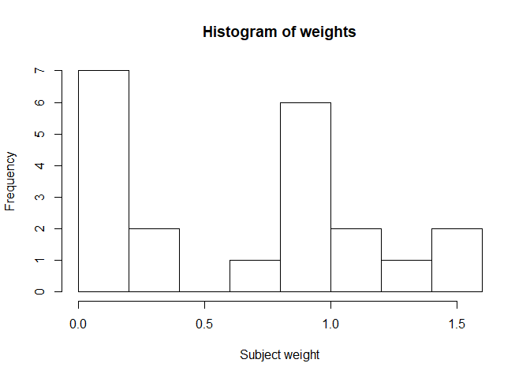

Readme for package maic
================

<!-- README.md is generated from README.Rmd. Please edit that file -->

# maic

<!-- badges: start -->

<!-- badges: end -->

maic is repeatable workflow for calculating subject/observation weights
for Matching Adjusted Indirect Comparison (MAIC).

MAIC is a form of population adjustment for indirect comparison that can
be undertaken when only aggregate data is available for the comparator
intervention, but full subject-level data is available for the
investigative intervention. By the method of moments, subject-level
weights are generated such that the weighted moments of the baseline
variables of the “index” intervention study match the reported moments
of the “target” study. Via the first two moments (mean and variance)
matching can be achieved on:

  - Mean of variable
  - Proportion of population with attribute
  - Proportion of population with variable below arbitrary value (by
    encoding as attribute)
  - Median or arbitrary quantile (by matching proportion of population
    below quantile value)
  - Variance of variable about matched mean
  - Standard deviation of variable about matched mean

In addition, subjects can be assigned zero weight where there is no
overlap with the target study, i.e.:

  - Subjects with attribute absent in target study (target proportion =
    0)
  - Subjects without attribute universal in target study (target
    proportion = 1)
  - Subjects with variable below minimum observed in target study
  - Subjects with variable above maximum observed in target study

The generated weights may then be used to form weighted comparisons
between intervention outcomes having removed bias for prognostic or
effect modifying covariables.

## Installation

You can install the released version of maic from
[CRAN](https://CRAN.R-project.org) with:

``` r
install.packages("maic")
```

And the development version from [GitHub](https://github.com/) with:

``` r
# install.packages("devtools")
devtools::install_github("heorltd/maic")
```

## Example

This example demonstrates how to create the MAIC weights by creation of
the configuration objects and running the optimisation procedure:

``` r
library(maic)
target <- c("Air.Flow" = 60,
           "Water.Temp" = 21,
           "Prop.Acid.Conc.LT.90" = 0.7,
           "min.air.flow" = 55)

stackloss$match.conc.lt.90 <- 
  ifelse(stackloss$Acid.Conc. < 90, 1, 0)

dict <- data.frame(
  "match.id" = 
    c("airflow", "watertemp", 
      "acidconc", "min.airflow"),
  "target.variable" = 
    c("Air.Flow", "Water.Temp",
      "Prop.Acid.Conc.LT.90", "min.air.flow"),
  "index.variable" = 
    c("Air.Flow", "Water.Temp",
      "match.conc.lt.90", "Air.Flow"),
  "match.type" = 
    c("mean", "mean", "proportion", "min"),
  stringsAsFactors = FALSE)

ipmat <- createMAICInput(
  index = stackloss,
  target = target,
  dictionary = dict,
  matching.variables = 
    c("airflow", "watertemp", 
      "acidconc", "min.airflow"))

wts <- maicWeight(ipmat)
```

``` r
plot(wts)
```


